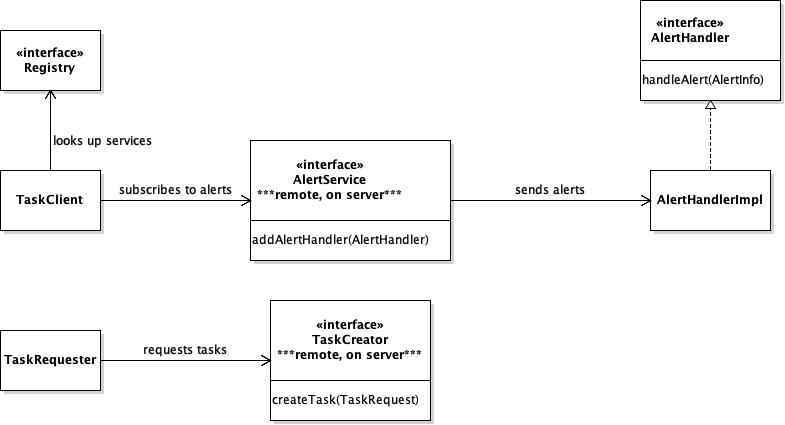
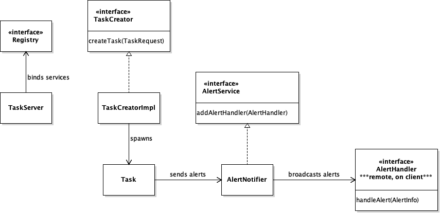

# rmi-example
A simple Java RMI example that uses the Maven build system

## Using in Eclipse

Use _File_ > _Import..._ and then _Existing Maven Projects_ to import the project into Eclipse.

## Building with Maven

    mvn package

## Running

You must start the server before the client, because the client expects the services exposed
by the server to be bound in the RMI registry. (A more sophisticated implementation of the
client might wait until a service was available.)

The server Java application is in the class `TaskServer`. The client is in the class `TaskClient`.
To start the server, either use _Run As_ and _Java Application_ within Eclipse, or build with Maven
and use this command line:

    java -cp target/rmi-example-1.0.0-SNAPSHOT.jar me.markrose.example.server.TaskServer

You can also start the client within Eclipse, or use this command line:

    java -cp target/rmi-example-1.0.0-SNAPSHOT.jar me.markrose.example.client.TaskClient localhost

You can stop the server and the client using control-C. (The server correctly handles a client
that terminates, but the client is not so graceful and just prints an exception to the console
when it can no longer communicate with the server.)

## Example

Server output

    $ java -cp target/rmi-example-1.0.0-SNAPSHOT.jar me.markrose.example.server.TaskServer
    [server] AlertService bound
    [server] TaskService bound
    [server] Got request for task: importModels
    [server] Got request for task: receiveData
    [server] Got request for task: processData
    [server] Got request for task: importModels
    [server] Got request for task: receiveData
    [server] Error while trying to send alert to client - removing handler

Client output

    $ java -cp target/rmi-example-1.0.0-SNSHOT.jar me.markrose.example.client.TaskClient localhost
    [client] About to request task: importModels
    [client] Result: true
    [client] Received alert with message: Task importModels started
    [client] About to request task: receiveData
    [client] Result: true
    [client] Received alert with message: Task receiveData started
    [client] Received alert with message: Task importModels completed
    [client] About to request task: processData
    [client] Result: true
    [client] Received alert with message: Task processData started
    [client] Received alert with message: Task receiveData completed
    [client] About to request task: importModels
    [client] Result: true
    [client] Received alert with message: Task importModels started
    [client] Received alert with message: Task processData completed
    [client] About to request task: receiveData
    [client] Result: true
    [client] Received alert with message: Task receiveData started
    ^C
    $

## Design

The server exposes two services as remote objects:

- _AlertService_ - This allows the client to subscribe to alerts by adding an alert handler.
- _TaskCreator_ - This allows the client to request that named tasks run on the server.

The client does not expose any services through the registry, but does make an alert handler
available for remote calls from the server. It passes a reference to this object by calling
the _AlertService_, above.

- _AlertHandler_ - Receives alerts messages from the server.

### TaskClient class diagram

### TaskServer class diagram

